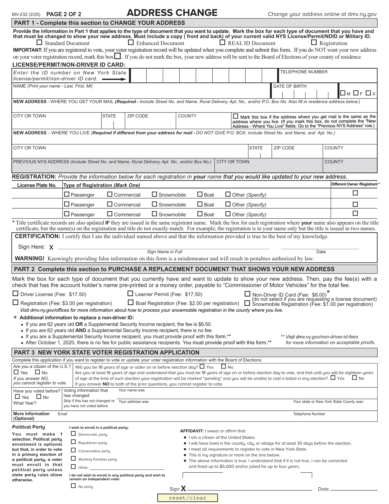
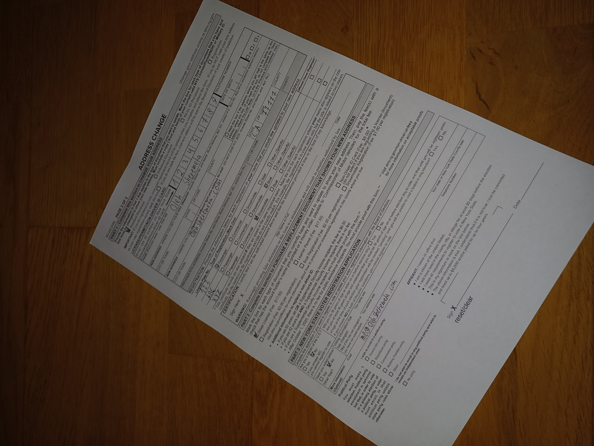
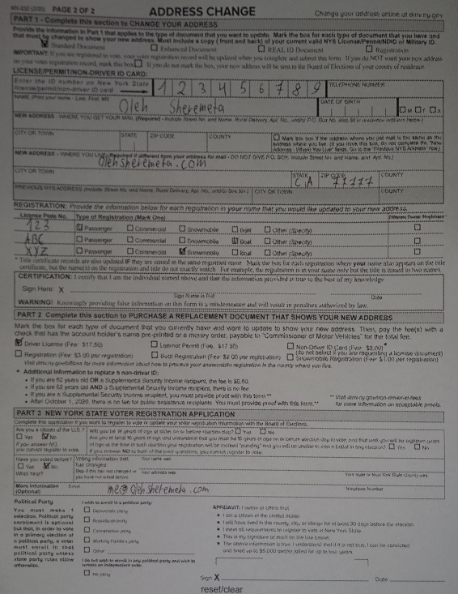

# OpenCV Homography Document Scan

Practical use of homography to align and warp a document to match a reference template.

## Demo



Here is our template



And this is filled out form as an example for the project.



After we ran the script we observe that document from original photograph was warped and transformed to look like the reference. Notice that even though on the photo corners of the document were not captured, script successfully managed to do correct transformation.

## How to run

```pip install -r requirements.txt```

then

```py main.py```

this will automatically use files included in this repo (```scan.jpg``` and ```ref.png```)

If you wish to use ```input()``` instead, uncomment commented lines of code and comment ```file = "scan.jpg"``` and  ```file = "ref.png"```